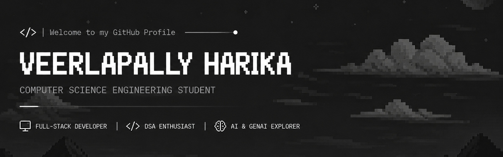

 
 

&nbsp;

&nbsp;

&nbsp;

&nbsp;

---

## `ABOUT ME`
 
I'm a **Computer Science Engineering student** passionate about building practical software
and solving real-world problems through technology. I enjoy working across **Full-Stack Development,
Data Structures & Algorithms, AI, and Generative AI**.

 

💻 **Full-Stack Development**
  •  
🧠 **DSA & Problem Solving**
  •  
🤖 **AI & GenAI**
  •  
🚀 **Project Development**

 

> **Code. Learn. Build. Repeat.**

---

## `TECHNOLOGIES`

 

 

 

---

## `FEATURED PROJECTS`

 

<table>
<tr>

<td width="33%" align="center" valign="top">

### 🌐 NGO Connect

A Python-based web platform focused on connecting NGOs and users.

 

`Python`

 

</td>

<td width="33%" align="center" valign="top">

### 📚 CRSES

A Python-based project developed as part of my programming and development journey.

 

`Python`

 

</td>

<td width="33%" align="center" valign="top">

### 🎓 CS50 Learning Journey

My Harvard CS50 learning journey containing selected weeks, exercises, and programming practice.

 

`C` `Algorithms` `Memory`

 

</td>

</tr>
</table>

---

## `GITHUB STATISTICS`

 

 

**TOTAL CONTRIBUTIONS**   •  
**CURRENT STREAK**   •  
**LONGEST STREAK**

---

## `CONTRIBUTION GRAPH`

 

---

## ✨ Thanks for visiting my profile!

 

Explore my repositories and see what I'm building.

 

 

Made with curiosity, code, and a lot of learning. 💜

